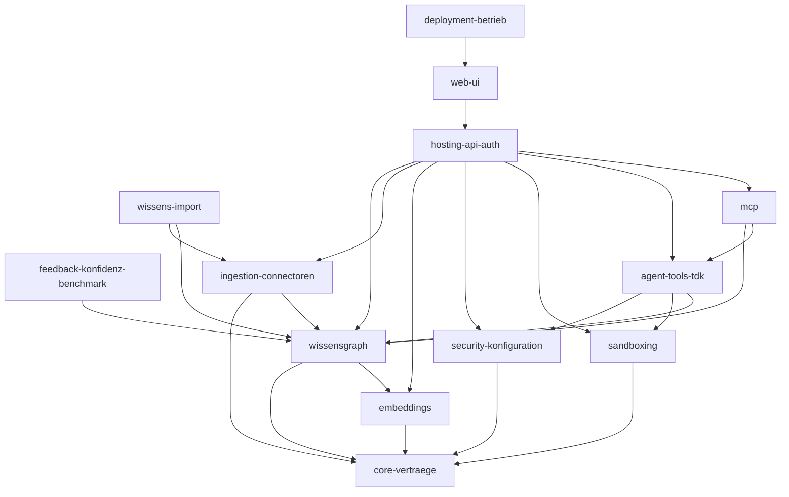

# Codebase-Blueprint

**Repository:** Edda
**Generiert:** 2026-06-17
**Scope:** Komplettes Repo (`src/` + Deployment)

## Überblick

Edda ist ein eigenständiger, lokal-only **Agent Knowledge Graph (AKG)** + **Test-Driven Knowledge (TDK)**
mit Embeddings, bereitgestellt als **MCP-Server** (HTTP/SSE und stdio) mit eigenem **Blazor-Server-UI**.
Beliebige Agenten/LLMs binden den Wissensgraphen über MCP an — **read-only**. Stack: .NET 10 · C# 13 ·
Neo4j 5 (oder Memgraph) · Blazor Server · ModelContextProtocol 1.4. Architektur: eine `Core`-Vertragsschicht,
darüber die Feature-Bibliotheken, zusammengeführt in `Edda.Hosting` und gehostet vom `Web`- (und
`Edda.Mcp.Stdio`-) Prozess.

## Features

| Feature | Kurzbeschreibung | Blueprint |
|---------|------------------|-----------|
| Core — Verträge | Interfaces + Modelle, die alle teilen (Interface-First) | [core-vertraege.md](./core-vertraege.md) |
| Wissensgraph (AKG) | Neo4j-Graph + 4-Phasen-Kontext-Kompilierung, Entity-Layer | [wissensgraph.md](./wissensgraph.md) |
| Feedback, Konfidenz & Benchmark | Rule-Feedback-Loop (F32), Konfidenz-Store, Retrieval-Benchmark (F48) | [feedback-konfidenz-benchmark.md](./feedback-konfidenz-benchmark.md) |
| Embeddings | 7 Provider (inkl. AWS Bedrock) + Resolving-Fassade + adaptives Chunking | [embeddings.md](./embeddings.md) |
| Ingestion & Connectoren | Pipeline + Git/GitLab-Gruppe/Custom-HTTP/Jira/Awork + LLM-Enrichment | [ingestion-connectoren.md](./ingestion-connectoren.md) |
| Wissens-Import | Upload (md/zip/pdf/html/csv/jsonl) + JSON-Wissensbündel (Im-/Export) | [wissens-import.md](./wissens-import.md) |
| MCP (Server & Client) | Tools spec-konform exponieren (read-only) + externe MCP-Quelle | [mcp.md](./mcp.md) |
| Agent-Tools & TDK | Tool-Registry + 6 Tools + sandboxed TDK-Validierung | [agent-tools-tdk.md](./agent-tools-tdk.md) |
| Sandboxing | Docker/Wasm/Null-Sandbox für die TDK-Ausführung | [sandboxing.md](./sandboxing.md) |
| Security & Konfiguration | AES-Credentials, Audit, Sanitizing, Live-Settings | [security-konfiguration.md](./security-konfiguration.md) |
| Hosting, API & Auth | DI-Komposition, REST-Endpoints, lokale Auth | [hosting-api-auth.md](./hosting-api-auth.md) |
| Web-UI | Blazor-Host (UI + REST + MCP/HTTP), Seiten & Komponenten | [web-ui.md](./web-ui.md) |
| Deployment & Betrieb | Compose-Stack + install.sh/ps1 + .env | [deployment-betrieb.md](./deployment-betrieb.md) |

## Abhängigkeitsgraph

Pfeil = „benutzt" (Compile-Referenz oder über einen Core-Vertrag zur Laufzeit/DI).

## Externe Kern-Dependencies

- `Neo4j.Driver` — Wissensgraph (AKG).
- `ModelContextProtocol` / `…AspNetCore` — MCP (Server/Client/stdio + HTTP/SSE im Web).
- `LibGit2Sharp` — Ingestion (Repo-Clone).
- `AWSSDK.BedrockRuntime` — Ingestion (Bedrock-Enrichment).
- `UglyToad.PdfPig` — Wissens-Import (PDF).
- `Microsoft.Data.Sqlite` — Feedback/Konfidenz.
- `Docker.DotNet` — Sandboxing (TDK-Container).
- `Microsoft.Extensions.Http` — Embeddings, Ingestion, MCP (HTTP-Clients).

## Wie diese Doku gepflegt wird

Diese Blueprints werden über den `codebase-mapper`-Skill erzeugt. Bei Code-Änderungen den Skill erneut
aufrufen („aktualisiere den Blueprint") — er erkennt `INDEX.md` und schlägt einen inkrementellen Re-Run vor.

## Verwandte Doku

- [`CLAUDE.md`](../../CLAUDE.md) — Architektur, Projektliste, absolute Regeln.
- [`README.md`](../../README.md) — Installationsanleitung + MCP-Anbindung.
- [`docs/chunking.md`](../chunking.md) — Adaptives Chunking (versteckte `:RuleChunk`-Retrieval-Ebene).
- [`docs/adr/`](../adr/README.md) — Architecture Decision Records (0001–0008).
