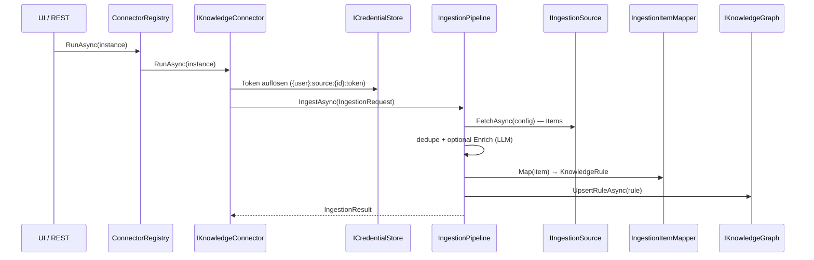

# Ingestion & Connectoren

## Zweck

Holt Wissen aus externen Quellen in den Graphen. Die **Ingestion-Pipeline** (fetch → optional
LLM-anreichern → mappen → serialisieren → upserten) wird von **config-getriebenen Connectoren** angesteuert:
Git-Repo, ganze GitLab-Gruppe (Batch), generisches Custom-HTTP/REST sowie Jira-/Awork-Presets. Neue
Quelltypen sind Konfiguration statt Code (siehe ADR-0005/0006). Enthält außerdem die LLM-Chat-Clients für
die optionale Anreicherung.

## Dateien

| Pfad | Rolle |
|------|-------|
| `src/AKG.Ingestion/Pipeline/IngestionPipeline.cs` | `IIngestionPipeline` — wählt Source, sammelt Items, dedupliziert, mappt, schreibt MD, upsertet. |
| `src/AKG.Ingestion/Sources/GitMarkdownSource.cs` | Klont ein Repo, scannt `.md`, baut hierarchische `IngestionItem`s (Wurzel→Repo→Dateien) + Links. |
| `src/AKG.Ingestion/Sources/GitLabGroupSource.cs` | Listet alle Repos einer GitLab-Gruppe und ingestiert jedes. |
| `src/AKG.Ingestion/Sources/HttpApiSource.cs` | Generische JSON-API → Items (Pointer-Mapping, Auth-Header, Pagination). |
| `src/AKG.Ingestion/Connectors/ConnectorRegistry.cs` | `IConnectorRegistry` — routet `ConnectorInstanceConfig` per TypeId. |
| `src/AKG.Ingestion/Connectors/GitKnowledgeConnector.cs` · `GitLabGroupKnowledgeConnector.cs` · `CustomHttpKnowledgeConnector.cs` · `JiraKnowledgeConnector.cs` · `AworkKnowledgeConnector.cs` | Connectoren (TypeIds `git`, `gitlab-group`, `custom-http`, `jira`, `awork`); lösen Token server-seitig auf. |
| `src/AKG.Ingestion/Git/LibGit2SharpGitClient.cs` · `GitItemIdentity.cs` | Clone via LibGit2Sharp; stabile Item-IDs (`git:slug:pfad`). |
| `src/AKG.Ingestion/GitLab/HttpGitLabClient.cs` · `HttpGitLabClientFactory.cs` | GitLab-REST (`/api/v4/groups/:id/projects`); Client pro Instanz (URL+Token). |
| `src/AKG.Ingestion/Mapping/IngestionItemMapper.cs` | `IngestionItem` → `KnowledgeRule` (Typ/Domäne, Relationen aus Links). |
| `src/AKG.Ingestion/Markdown/MarkdownFrontmatter.cs` · `FrontmatterSerializer.cs` | Frontmatter parsen/serialisieren. |
| `src/AKG.Ingestion/Globbing/GlobMatcher.cs` | Pfad-Glob-Filter. |
| `src/AKG.Ingestion/Llm/*.cs` | Chat-Clients (Anthropic, OpenAI-kompatibel, Gemini, Bedrock, Ollama, OpenRouter) + `LlmChatClientFactory` + `ResolvingLlmChatClient`. |
| `src/AKG.Ingestion/Enrichment/*.cs` | `LlmIngestionEnricher`, `NullIngestionEnricher`, `ResolvingIngestionEnricher` (greift nur, wenn aktiviert). |
| `src/AKG.Ingestion/DependencyInjection/IngestionServiceExtensions.cs` | `AddIngestionServices` — Sources, Connectoren, Enricher. |

## Abhängigkeiten

### Intern
- **Core** — `IIngestionPipeline`, `IIngestionSource`, `IKnowledgeConnector`, `IConnectorRegistry`, `IGitClient`, `IGitLabClient(Factory)`, `IIngestionEnricher`, `IngestionModels`, `ConnectorModels`.
- **Wissensgraph (AKG)** (Laufzeit) — `IKnowledgeGraph.UpsertRuleAsync`.
- **Security** (Laufzeit) — `ICredentialStore` (per-Instanz-Token), `ISettingsService` (Live-Provider/Key).

### Extern (Packages)
- `LibGit2Sharp` — Repository-Clone (ADR-0002).
- `AWSSDK.BedrockRuntime` — Bedrock-Chat-Client für die Anreicherung.
- `Microsoft.Extensions.Http` — `IHttpClientFactory` (GitLab/HTTP/LLM).

## Öffentliche API / Interface

- `IIngestionPipeline.IngestAsync(IngestionRequest)` → `IngestionResult` (best-effort, wirft nie).
- `IConnectorRegistry.Describe()` (Deskriptoren fürs UI) / `RunAsync(ConnectorInstanceConfig)`.
- `IKnowledgeConnector` — `TypeId`, `Describe()`, `RunAsync(...)`. TypeIds: `git`, `gitlab-group`,
  `custom-http`, `jira`, `awork` (+ `mcp` aus Feature *MCP*).

## Datenfluss / Call-Flow

## Offene Fragen / TODOs

- Awork-/Jira-Presets enthalten Vendor-Defaults (Endpoint/Pagination/Auth), die gegen die reale Tenant zu
  prüfen sind; der generische `custom-http`-Connector ist der garantierte Fallback.
