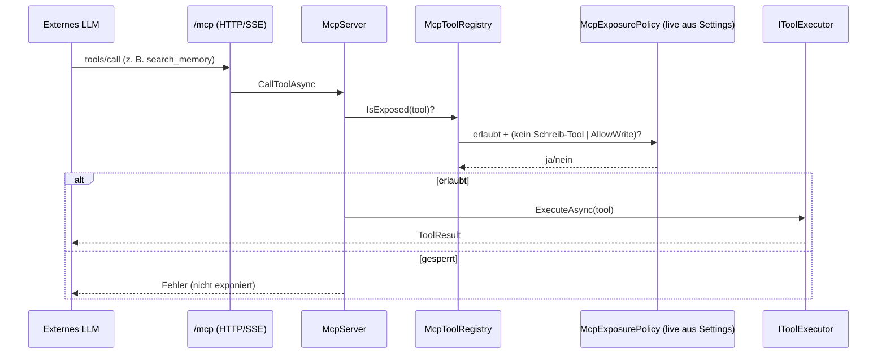

# MCP (Server & Client)

## Zweck

Bidirektionale Model-Context-Protocol-Integration. **Server** (intern→extern): exponiert die erlaubten
AKG-Tools spec-konform über HTTP/SSE (`/mcp`) und stdio an externe LLMs — **read-only by default**.
**Client** (extern→intern): bindet einen externen MCP-Server als Wissensquelle an (oder importiert dessen
Tools). Die Exposure ist live über das Web-UI konfigurierbar (siehe ADR-0006).

## Dateien

| Pfad | Rolle |
|------|-------|
| `src/AKG.Mcp/Server/McpServer.cs` | `tools/list` + `tools/call` gegen den internen Tool-Layer. |
| `src/AKG.Mcp/Server/McpToolRegistry.cs` | Filtert exponierbare Tools; löst die Policy **pro Aufruf** via `Func<McpExposurePolicy>` auf (live). |
| `src/AKG.Mcp/Server/McpExposurePolicy.cs` | Default-Deny-Allowlist + Read-only-Garantie (Schreib-Tools gesperrt außer `MCP_ALLOW_WRITE_TOOLS`). |
| `src/AKG.Mcp/Server/McpProtocolHandlers.cs` | Brücke zum offiziellen MCP-SDK-Server. |
| `src/AKG.Mcp/Adapter/McpAdapter.cs` | Mapping intern ↔ MCP-Protokoll-Typen. |
| `src/AKG.Mcp/Client/ExternalMcpClient.cs` · `IExternalMcpClient.cs` | JSON-RPC-2.0-Client (Streamable HTTP, Initialize/SSE/Session). |
| `src/AKG.Mcp/Client/McpToolImporter.cs` · `McpToolSource.cs` · `ExternalMcpToolClientAdapter.cs` | Externe MCP-Tools als interne Tools nutzbar machen. |
| `src/AKG.Mcp/Knowledge/McpKnowledgeSource.cs` · `McpKnowledgeConnector.cs` | Externer MCP-Server als Wissensquelle (TypeId `mcp`). |
| `src/AKG.Mcp/Knowledge/HttpExternalMcpClientFactory.cs` · `IExternalMcpClientFactory.cs` | Client pro Quell-Instanz (URL + Bearer). |
| `src/AKG.Mcp/DependencyInjection/McpServiceExtensions.cs` | `AddMcpServices` — Server, Client, Knowledge-Source; resolved Policy aus Settings. |
| `src/Edda.Mcp.Stdio/Program.cs` | stdio-MCP-Host (lokale Clients, z. B. Claude Desktop). |

## Abhängigkeiten

### Intern
- **Core** — `IToolRegistry`/`IToolExecutor`, `IIngestionPipeline`, `IKnowledgeConnector`, `ISettingsService` (`McpSettings`).
- **Wissensgraph (AKG)** — referenziert (AKG.Mcp → AKG).
- **Agent-Tools & TDK** (Laufzeit) — liefert die exponierten Tools.

### Extern (Packages)
- `ModelContextProtocol` (Server/Client/stdio) · `ModelContextProtocol.AspNetCore` (HTTP/SSE im Web-Host).

## Öffentliche API / Interface

- **Server:** `GET/POST /mcp` (HTTP/SSE, auth) — `tools/list`, `tools/call`. Exponiert nur Allowlist-Tools;
  Read-only (Schreib-Tools `manage_*` gesperrt, außer `MCP_ALLOW_WRITE_TOOLS=true`). Allowlist live über
  *Einstellungen → MCP-Server* (`McpSettings`: Enabled, ExposedTools, AllowWriteTools).
- **Client:** `IExternalMcpClient` — `ListToolsAsync`, `CallToolAsync`. Connector `mcp` (ServerUrl,
  ToolName, ArgsJson, Bearer-Token).

## Datenfluss / Call-Flow — Read-only-Exposition

## Offene Fragen / TODOs

- Das Ergebnis-Mapping der MCP-Wissensquelle ist generisch (ein Item je Text-Content-Block), da die
  Tool-Ausgabe server-definiert ist.
