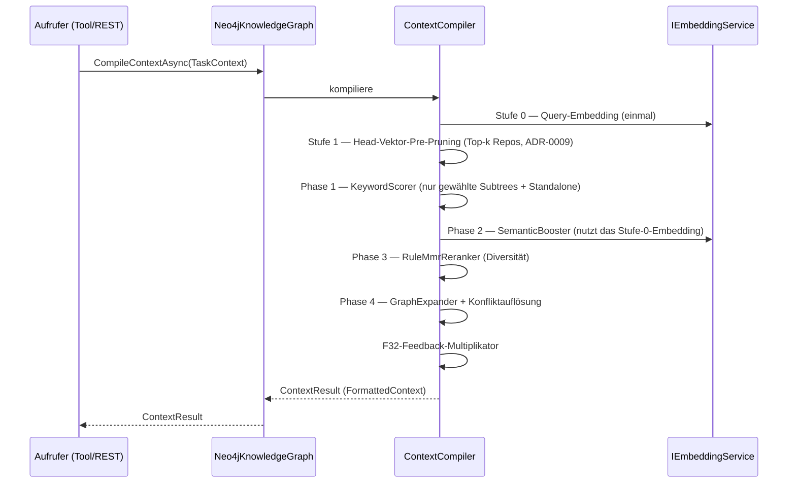

# Wissensgraph (AKG)

## Zweck

Das Herzstück von Edda: speichert Wissensregeln und ihre typisierten Relationen in **Neo4j** (oder
Memgraph) und kompiliert pro Aufgabe den aktiven Kontext. Bei ingesteten Repos läuft vorab ein
hierarchisches Pre-Pruning (ADR-0009): Stufe 1 wählt per Head-Vektor die relevantesten Repo-Subtrees, erst
darauf folgen die **vier Phasen** (Keyword → semantisch → MMR → Konfliktauflösung). Umfasst zudem die
Domänen-Verwaltung, World-Knowledge-Seeding, einen Entity-Layer und den Embedding-Cache.

## Dateien

| Pfad | Rolle |
|------|-------|
| `src/AKG/Graph/Neo4jKnowledgeGraph.cs` | `IKnowledgeGraph`-Implementierung (Upsert/Get/Delete/Stats/Context). |
| `src/AKG/Graph/Neo4jCypherExecutor.cs` | `ICypherExecutor` — Cypher gegen Neo4j/Memgraph. |
| `src/AKG/Providers/Neo4jGraphDatabaseProvider.cs` · `MemgraphGraphDatabaseProvider.cs` | DB-Provider (per `GRAPH_PROVIDER`). |
| `src/AKG/Graph/RuleLoader.cs` | Lädt Regeln aus `knowledge/`-Markdown in den Graphen. |
| `src/AKG/Graph/WorldKnowledgeSeeder.cs` · `WorldKnowledgeSeedHostedService.cs` | Seeded Welt-Wissen beim Start. |
| `src/AKG/Graph/Neo4jEntityStore.cs` | LightRAG-artiger Entity-Layer (F49). |
| `src/AKG/Graph/DomainManager.cs` · `GraphValidator.cs` · `NodeMapper.cs` | Domänen, Konsistenzprüfung, Knoten-Mapping. |
| `src/AKG/Parser/KnowledgeRuleParser.cs` | Parst Frontmatter-Markdown → `KnowledgeRule`. |
| `src/AKG/Embeddings/Neo4jEmbeddingCache.cs` · `EmbeddingBackfillHostedService.cs` | Speichert/holt Regel-Embeddings; resilientes Hintergrund-Backfill (nutzt `IEmbeddingService`). |
| `src/AKG/Embeddings/Neo4jHeadVectorStore.cs` · `KMeans.cs` | Head-Vektoren (Multi-Centroids je Repo) für das Stufe-1-Pre-Pruning (ADR-0009); eigener `head_embeddings`-Index. |
| `src/AKG/Context/ContextCompiler.cs` | Orchestriert Stufe-0/1-Pre-Pruning + die 4 Phasen + F32-Feedback-Multiplikator. |
| `src/AKG/Context/KeywordScorer.cs` · `SemanticBooster.cs` · `RuleMmrReranker.cs` · `GraphExpander.cs` | Phasen 1–4. |
| `src/AKG/Context/DomainActivationResolver.cs` · `ToolboxResolver.cs` · `WorldKnowledgeFetcher.cs` · `ScoredRule.cs` | Kontext-Bausteine. |
| `src/AKG/DependencyInjection/AkgServiceExtensions.cs` | `AddAkgServices` — verdrahtet Graph, Compiler, Seeder, Feedback. |

## Abhängigkeiten

### Intern
- **Core** — `IKnowledgeGraph`, `ICypherExecutor`, `IContextCompiler`, `KnowledgeRule`, `ContextResult`, `TaskContext`.
- **Embeddings** (Laufzeit/DI) — `IEmbeddingService` für Phase 2 + Embedding-Cache.
- **Feedback & Benchmark** (gleiches Projekt) — `IRuleFeedbackService` als optionaler F32-Multiplikator.

### Extern (Packages)
- `Neo4j.Driver` — Graph-Datenbank-Treiber.
- (`Microsoft.Data.Sqlite`, `UglyToad.PdfPig` liegen im selben Projekt, gehören aber zu *Feedback/Benchmark* bzw. *Wissens-Import*.)

## Öffentliche API / Interface

```csharp
public interface IKnowledgeGraph
{
    Task<IReadOnlyList<KnowledgeRule>> GetRulesAsync(string? domain, string? type, string? tag, string? userId, CancellationToken ct);
    Task<KnowledgeRule?> GetRuleAsync(string id, …);
    Task<KnowledgeRule> UpsertRuleAsync(KnowledgeRule rule, CancellationToken ct);
    Task DeleteRuleAsync(string id, string? userId, bool isAdmin, CancellationToken ct);
    Task<ContextResult> CompileContextAsync(TaskContext task, CancellationToken ct);
    Task<IReadOnlyList<KnowledgeRule>> FindNeighborsAsync(string ruleId, …);
    Task<GraphStats> GetStatsAsync(…);
    Task<int> ReloadWorldKnowledgeAsync(…);
}
```

## Datenfluss / Call-Flow — Kontext-Kompilierung (Pre-Pruning + 4 Phasen)



## Offene Fragen / TODOs

- Vektorindex-Recreate bei Embedding-Dimensionswechsel ist offen (App-seitiger Cosine-Fallback greift, vgl.
  Feature *Embeddings*).
